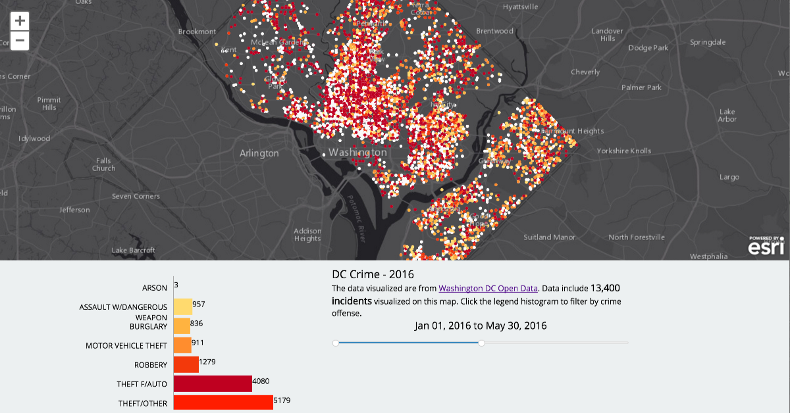
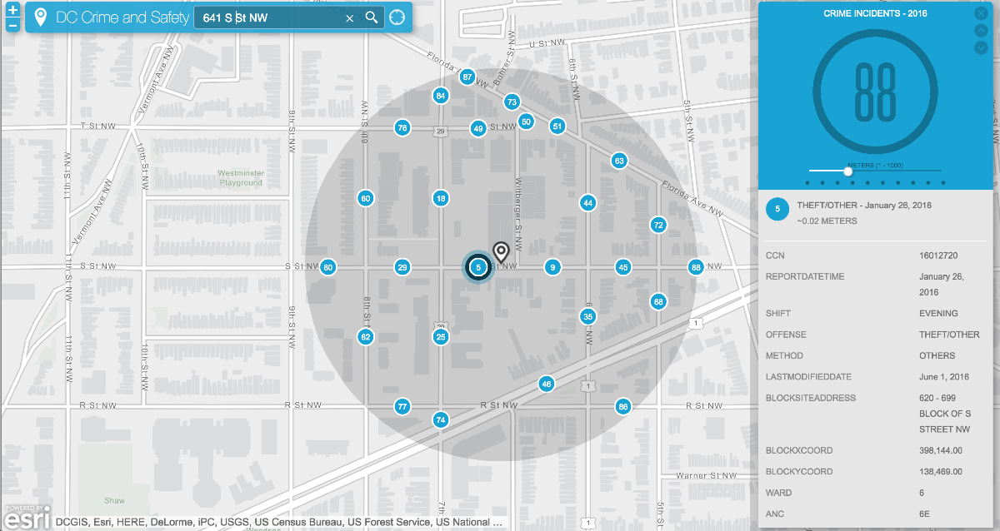
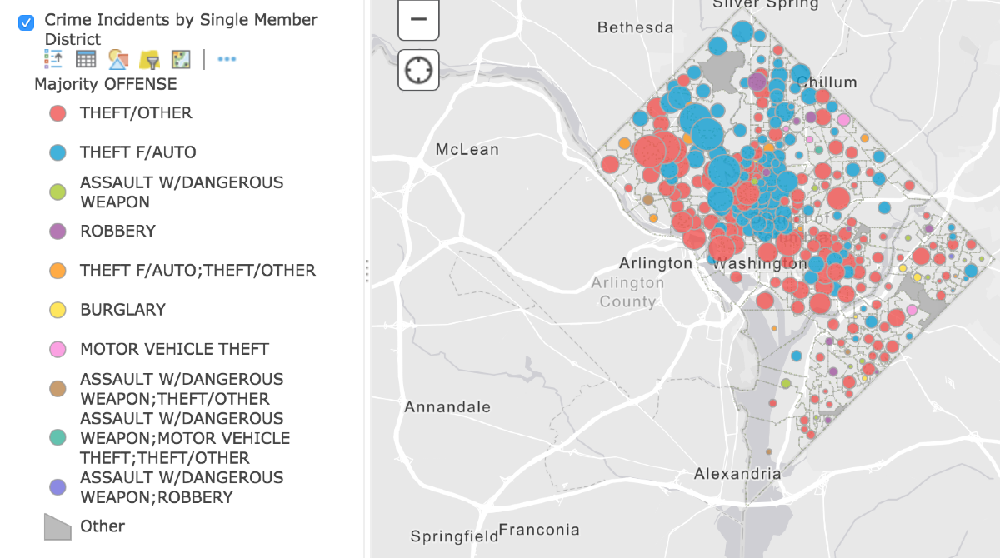

# dc-crime

There are a few example apps here. The first is a [simple temporal visualization](http://ajturner.github.io/dc-crime) of DC Crime from [2016 crimes on DC Open Data](http://opendata.dc.gov/datasets/bda20763840448b58f8383bae800a843_26).

- [See Temporal Visualization](http://ajturner.github.io/dc-crime/index.html)

The second is a ["crime near me" viewer](http://ajturner.github.io/dc-crime/nearby/index.html) where you can enter an address and see nearby crime incidents as well as demographics and social tapestry.

- [See Nearby Crime](http://ajturner.github.io/dc-crime/nearby/index.html)

## Analysis

An interactive [map of Major Offense Type by Single Member District](http://dcdev.maps.arcgis.com/home/webmap/viewer.html?webmap=9fca7613b7fc40c283c493e9f1844f2d)

## Technology

- [cublet](https://github.com/chelm/cublet) to convert GeoJSON into tilecubes
- [esri-tilecube-layer](https://github.com/chelm/esri-tilecube-layer) to add to a map
- [Local Perspective](https://github.com/SpatialAgent/local-perspective) app template

a Work in Progress...
